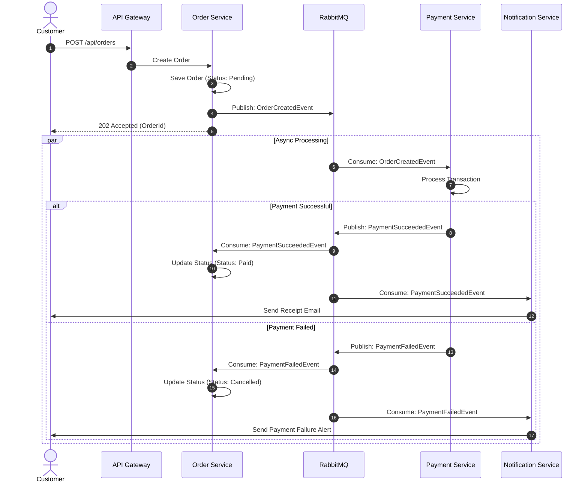

# MicroShop

[](https://dotnet.microsoft.com/)
[](https://www.postgresql.org/)
[](https://www.rabbitmq.com/)
[](https://www.docker.com/)
[](https://masstransit.io/)
[](LICENSE)

**MicroShop** is a distributed, event-driven e-commerce microservices reference application built with **ASP.NET Core (.NET 9)**, **Entity Framework Core**, **PostgreSQL**, **RabbitMQ**, and **Docker**.

The primary objective of this project is to serve as a practical, hands-on implementation of distributed systems patterns, database-per-service isolation, asynchronous event choreography, saga transactions, and containerized local orchestration.

---

## Table of Contents

- [MicroShop](#microshop)
  - [Table of Contents](#table-of-contents)
  - [Architecture Overview](#architecture-overview)
    - [High-Level Topology](#high-level-topology)
    - [Core Architectural Tenets](#core-architectural-tenets)
  - [Service Boundaries \& Domains](#service-boundaries--domains)
  - [Technology Stack](#technology-stack)
  - [Repository Structure](#repository-structure)
  - [Getting Started](#getting-started)
    - [Prerequisites](#prerequisites)
    - [1. Clone Repository](#1-clone-repository)
    - [2. Start Infrastructure via Docker Compose](#2-start-infrastructure-via-docker-compose)
    - [3. Apply Database Migrations](#3-apply-database-migrations)
    - [4. Run Services Locally](#4-run-services-locally)
  - [Communication \& Distributed Workflows](#communication--distributed-workflows)
    - [Synchronous HTTP (Query \& Immediate Commands)](#synchronous-http-query--immediate-commands)
    - [Asynchronous Event Choreography (RabbitMQ + MassTransit)](#asynchronous-event-choreography-rabbitmq--masstransit)
    - [Saga \& Compensating Transactions](#saga--compensating-transactions)
  - [Implementation Roadmap](#implementation-roadmap)
  - [Resilience \& Failure Handling](#resilience--failure-handling)
  - [Observability \& Monitoring](#observability--monitoring)
  - [Contributing](#contributing)
  - [License](#license)

---

## Architecture Overview

### High-Level Topology

```text
                     ┌────────────────────────┐
                     │     Frontend / Client  │
                     │    (SPA / Mobile/ CLI) │
                     └───────────┬────────────┘
                                 │
                                 ▼
                     ┌────────────────────────┐
                     │       API Gateway      │
                     │         (YARP)         │
                     └───────────┬────────────┘
                                 │
         ┌───────────────────────┼───────────────────────┐
         │                       │                       │
         ▼                       ▼                       ▼
  ┌──────────────┐        ┌──────────────┐        ┌──────────────┐
  │   Product    │        │    Order     │        │   Payment    │
  │   Service    │        │   Service    │        │   Service    │
  └──────┬───────┘        └──────┬───────┘        └──────┬───────┘
         │                       │                       │
    PostgreSQL              PostgreSQL              PostgreSQL
  (Product DB)              (Order DB)              (Payment DB)
                                 │
                            Events (Pub/Sub)
                                 │
                                 ▼
                     ┌────────────────────────┐
                     │     Message Broker     │
                     │       (RabbitMQ)       │
                     └───────────┬────────────┘
                                 │
                                 ▼
                     ┌────────────────────────┐
                     │  Notification Service  │
                     │  (Consumer / Dispatch) │
                     └────────────────────────┘
```

### Core Architectural Tenets

1. **Database-per-Service Pattern**: Each microservice strictly owns its operational database. Direct cross-database joins or cross-service database access are forbidden.
2. **Decoupled Asynchronous Messaging**: High-volume, multi-stage state transitions (such as order placements, stock adjustments, and payment processing) use publish-subscribe events via RabbitMQ.
3. **Smart Endpoints, Dumb Pipes**: Business logic resides strictly within domain boundaries rather than in the transport middleware.
4. **Single-Responsibility Boundaries**: Services are segregated by bounded contexts (Catalog, Ordering, Billing, Notifications).

---

## Service Boundaries & Domains

| Service | Primary Responsibility | Storage | Communication |
| :--- | :--- | :--- | :--- |
| **`MicroShop.Product`** | Product catalog, pricing, inventory stock management | PostgreSQL (`microshop_products`) | REST / Async Events |
| **`MicroShop.Order`** | Order placement, state machine (Created, Paid, Cancelled) | PostgreSQL (`microshop_orders`) | REST / MassTransit Publisher |
| **`MicroShop.Payment`** | Payment transaction processing, charge authorization | PostgreSQL (`microshop_payments`) | MassTransit Consumer/Publisher |
| **`MicroShop.Notification`**| Email/SMS dispatch, order & receipt confirmations | Stateless / Worker | MassTransit Consumer |
| **`MicroShop.Gateway`** | Request routing, SSL termination, rate limiting, Auth | None (YARP) | Reverse Proxy |

---

## Technology Stack

| Layer | Technology | Details |
| :--- | :--- | :--- |
| **Runtime & Language** | .NET 9 / C# 13 | High-performance, cross-platform backend runtime |
| **Web Framework** | ASP.NET Core Web API | RESTful controller-based endpoints with OpenAPI/Swagger |
| **Data Access & ORM** | Entity Framework Core 9 | Code-First migrations with Npgsql PostgreSQL provider |
| **Database** | PostgreSQL 17 | Dedicated containerized relational databases per service |
| **Message Broker** | RabbitMQ | AMQP message broker for distributed event dispatching |
| **Service Bus Library** | MassTransit | Transport abstraction, retry policies, outbox pattern |
| **API Gateway** | YARP (Yet Another Reverse Proxy) | High-performance reverse proxy toolkit for .NET |
| **Containers & Orchestration** | Docker & Docker Compose | Multi-container local developer environment |
| **Testing** | xUnit, FluentAssertions, Testcontainers | Unit tests and isolated integration test suites |
| **Logging & Telemetry** | Serilog, OpenTelemetry | Structured logging and distributed tracing |

---

## Repository Structure

```text
MicroShop/
│
├── .github/                       # CI/CD workflows and automation
├── src/
│   ├── Gateway/
│   │   └── MicroShop.Gateway/     # YARP Reverse Proxy and routing configuration
│   │
│   ├── Services/
│   │   ├── MicroShop.Product/     # Product Catalog & Inventory Service
│   │   ├── MicroShop.Order/       # Order Management Service
│   │   ├── MicroShop.Payment/     # Payment Processing Service
│   │   └── MicroShop.Notification/# Notification & Email Dispatch Service
│   │
│   └── BuildingBlocks/
│       ├── EventBus/              # MassTransit & RabbitMQ shared extensions
│       └── Contracts/             # Integration events & shared DTO contracts
│
├── tests/
│   ├── MicroShop.Product.Tests/   # Unit & Integration tests for Product Service
│   ├── MicroShop.Order.Tests/     # Unit & Integration tests for Order Service
│   └── MicroShop.Payment.Tests/   # Unit & Integration tests for Payment Service
│
├── docker-compose.yml             # Local infrastructure (PostgreSQL instances, RabbitMQ)
├── MicroShop.slnx                 # Solution file (.NET SLNX format)
└── README.md                      # Project documentation
```

> [!NOTE]
> Shared libraries in `BuildingBlocks/` only contain protocol definitions, integration event contracts, and infrastructure helpers. Domain models and business logic remain strictly isolated within their respective service boundaries.

---

## Getting Started

### Prerequisites

Ensure you have the following installed on your machine:
- [.NET 9.0 SDK](https://dotnet.microsoft.com/download/dotnet/9.0)
- [Docker Desktop](https://www.docker.com/products/docker-desktop/) or Docker Engine with Docker Compose v2+
- IDE: [Visual Studio 2022 / 2025](https://visualstudio.microsoft.com/), [JetBrains Rider](https://www.jetbrains.com/rider/), or [VS Code](https://code.visualstudio.com/) with C# Dev Kit

---

### 1. Clone Repository

```bash
git clone https://github.com/your-username/MicroShop.git
cd MicroShop
```

---

### 2. Start Infrastructure via Docker Compose

Spin up the local database instances and message brokers:

```bash
docker compose up -d
```

Verify that the infrastructure containers are healthy:

```bash
docker compose ps
```

| Service Container | Host Port | Container Port | Default Database / Details |
| :--- | :--- | :--- | :--- |
| `microshop-product-db` | `5433` | `5432` | `microshop_products` (User: `postgres`) |
| `microshop-rabbitmq` | `5672`, `15672` | `5672`, `15672` | Management UI: `http://localhost:15672` |

---

### 3. Apply Database Migrations

Apply Entity Framework Core migrations to create the required schema:

```bash
# Product Service
dotnet ef database update --project src/MicroShop.Product
```

---

### 4. Run Services Locally

To launch a specific service during local development:

```bash
dotnet run --project src/MicroShop.Product
```

Navigate to OpenAPI / Swagger documentation:
- Product Service: `https://localhost:7123/swagger` (or configured development port)

---

## Communication & Distributed Workflows



### Synchronous HTTP (Query & Immediate Commands)
Direct HTTP communication via `HttpClient` (using Typed Clients and Polly resilience policies) is reserved for synchronous queries and gateway proxying.

### Asynchronous Event Choreography (RabbitMQ + MassTransit)
State transitions across service boundaries are published as integration events:
- `OrderCreatedEvent`: Dispatched when an order is received.
- `PaymentRequestedEvent`: Dispatched to trigger payment processing.
- `PaymentSucceededEvent` / `PaymentFailedEvent`: Triggers downstream order confirmation or compensation.

### Saga & Compensating Transactions
When an operation fails halfway through a distributed transaction (e.g. payment failure after inventory reservation), compensating actions are triggered asynchronously:

```text
[OrderCreated] ──► [PaymentRequested] ──► [PaymentFailed] ──► [Compensate: CancelOrder & ReleaseStock]
```

---

## Implementation Roadmap

This project is built iteratively following a progressive milestone-driven roadmap:

- [x] **Milestone 1: Service Foundation & Data Isolation**
  - [x] Solution & project scaffolding (.NET 9)
  - [x] Product Service initial Web API implementation
  - [x] PostgreSQL database integration via EF Core & Docker Compose
  - [x] CRUD controllers for product management
- [ ] **Milestone 2: Multi-Service Domain Decomposition**
  - [ ] Scaffold `Order Service` and `Payment Service`
  - [ ] Configure independent PostgreSQL containers for each service
  - [ ] Implement inter-service synchronous HTTP calls with Typed Clients
- [ ] **Milestone 3: Event-Driven Messaging with RabbitMQ**
  - [ ] Add RabbitMQ container to `docker-compose.yml`
  - [ ] Integrate MassTransit across Order, Payment, and Notification services
  - [ ] Publish and consume `OrderCreated` and `PaymentCompleted` events
- [ ] **Milestone 4: Sagas, Outbox Pattern & Failure Compensation**
  - [ ] Implement MassTransit Saga State Machine for distributed checkout workflow
  - [ ] Implement Transactional Outbox pattern to prevent message loss
  - [ ] Write integration test cases for simulated service failure and rollback
- [ ] **Milestone 5: API Gateway & Security**
  - [ ] Configure YARP Gateway for central routing and request aggregation
  - [ ] Add JWT authentication & authorization checks at the gateway
- [ ] **Milestone 6: Distributed Observability**
  - [ ] Configure OpenTelemetry tracing with Jaeger
  - [ ] Centralize structured logging with Serilog and Seq

---

## Resilience & Failure Handling

To guarantee reliability across unreliable distributed networks, MicroShop incorporates the following resiliency patterns:

- **Retry Policies with Exponential Backoff**: Transient network failures and connection blips automatically retry before throwing exceptions.
- **Circuit Breaker**: Prevents cascading failures by halting calls to downstream services that are continuously failing.
- **Idempotent Consumers**: Consumers safely handle duplicate event deliveries without creating corrupted or duplicate state.
- **Dead Letter Queues (DLQ)**: Poison messages that fail processing after maximum retries are isolated for manual inspection.

---

## Observability & Monitoring

MicroShop uses OpenTelemetry to provide full end-to-end distributed tracing across synchronous HTTP calls and asynchronous RabbitMQ message queues:

```text
Trace: [9b3f4c81...]
├── Gateway              [GET /orders/101]   ->  12ms
│   ├── Order Service    [Process Order]     ->  34ms
│   │   ├── Product DB   [SELECT Query]      ->   4ms
│   │   └── RabbitMQ     [Publish Event]     ->   3ms
│   └── Payment Service  [Consume Event]     ->  85ms
│       └── Payment DB   [INSERT Payment]    ->   9ms
```

---

## Contributing

Contributions are welcome! Please follow these steps:

1. Fork the repository.
2. Create a descriptive feature branch (`git checkout -b feature/order-saga-statemachine`).
3. Commit your changes following [Conventional Commits](https://www.conventionalcommits.org/).
4. Ensure all tests pass (`dotnet test`).
5. Open a Pull Request.

---

## License

This project is licensed under the [MIT License](LICENSE).
